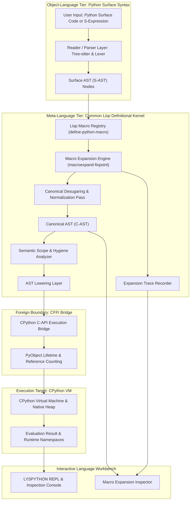
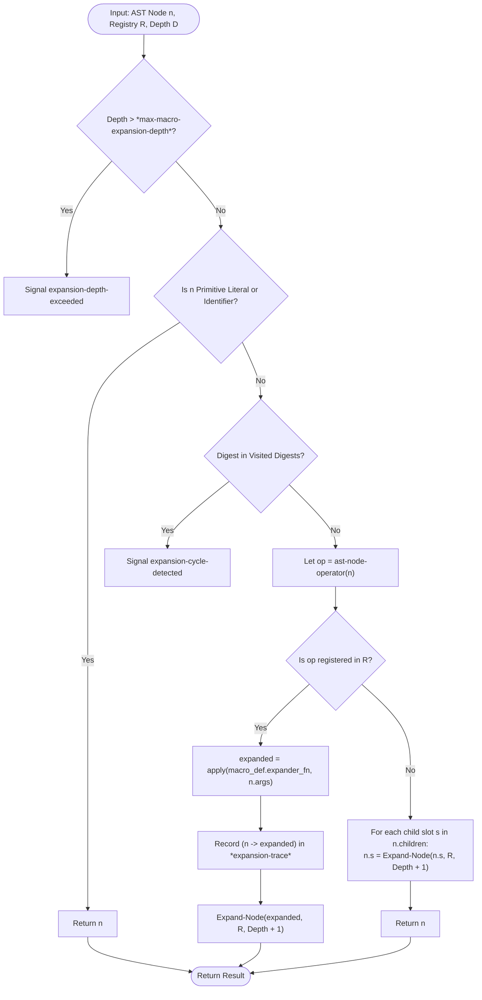

# LYSPYTHON: System Architecture and Engineering Specification

**Specification Version**: 1.0.0-PROPOSED  
**Target Systems**: SBCL 2.2+, CPython 3.10+  
**Architecture Classification**: Multi-Stage Heterogeneous Meta-Runtime  

---

## 1. Architectural Goals

The design of LYSPYTHON is governed by five non-negotiable architectural mandates:

1. **Meta-Linguistic Primacy**: The Common Lisp host must remain the supreme arbiter of syntax interpretation, AST rewriting, and semantic lowering. CPython functions strictly as an execution slave and native library host.
2. **Structural Homoiconicity at the AST Layer**: Python surface code is represented as symbolic, inspectable Common Lisp data structures (S-AST), permitting quasiquotation, pattern matching, and tree rewrites native to Lisp.
3. **Deterministic Multi-Pass Expansion**: The macro expansion engine must be deterministic, supporting single-step expansion, cycle-detected fixed-point expansion, and detailed execution trace generation.
4. **Zero Semantic Leakage**: Lowering to CPython must only occur once all user and built-in macros have reached an irreducible canonical form. No unexpanded surface forms may pass into the C-API bridge.
5. **Interactive Introspection**: Every phase of the compilation and evaluation pipeline must be transparently inspectable at the REPL and over the Language Server Protocol.

---

## 2. High-Level System Overview



---

## 3. Layered Architecture and Subsystem Responsibilities

### 3.1 Subsystem Decomposition

| Layer | Subsystem Directory | Key Responsibilities |
| :--- | :--- | :--- |
| **Core Kernel** | `src/core/` | Runtime lifecycle, package definition, global state coordination, error conditions. |
| **Reader / Parser** | `src/reader/` | Surface ingestion, tokenization, Tree-sitter AST bridge, s-expression parser. |
| **AST Definitions** | `src/ast/` | Surface AST classes (`surface.lisp`), Canonical AST classes (`canonical.lisp`). |
| **Macro Engine** | `src/macros/` | Macro registry, pattern matcher, expander, cycle detection, built-in semantic macros. |
| **Transform & Semantics**| `src/transform/`, `src/semantics/` | Desugaring (`for` -> `while`, `with` -> `try`), scope resolution, variable bindings. |
| **Lowering** | `src/lowering/` | Canonical AST to CPython execution structures, expression tree compilation. |
| **Bridge** | `src/bridge/` | CFFI bindings to `libpython`, `PyObject*` lifetime management, error propagation. |
| **Environment** | `src/env/` | Symbol tables, lexical scopes, frame stacks, namespace synchronization. |
| **Runtime & Eval** | `src/runtime/` | Pipeline orchestrator tying reader, macro engine, lowering, and bridge together. |
| **REPL & Tooling** | `src/repl/`, `src/cli/`, `src/lsp/` | Interactive shell, expansion inspector, CLI entry point, Language Server Protocol. |

---

## 4. Surface AST vs. Canonical AST

A foundational design principle in LYSPYTHON is the strict separation between the **Surface AST** and the **Canonical AST**.

### 4.1 Surface AST (`src/ast/surface.lisp`)
The Surface AST models Python code as written by the programmer. It preserves all syntactic variety:
- Comprehensions (`list-comp`, `dict-comp`, `set-comp`, `gen-expr`)
- Structured loops (`for-in`, `while-else`)
- Complex exception handling (`try-except-else-finally`)
- Pattern matching (`match-case`)
- Function and class decorators (`@decorator`)
- In-place augmented assignments (`+=`, `-=`, etc.)

Surface AST nodes are polymorphic instances of `ast-surface-node`. They are mutable during macro passes and retain source code location metadata (line, column, byte offset).

### 4.2 Canonical AST (`src/ast/canonical.lisp`)
The Canonical AST is a minimal, orthogonal, and irreducible intermediate representation. Complex syntactic forms are desugared away:
- `for` loops are rewritten into iterator allocation, `while` loops, and `StopIteration` handling.
- `with` blocks are rewritten into enter-calls, binding, and `try-finally` cleanup.
- Augmented assignments are rewritten into explicit binary expressions and target stores.
- Comprehensions are desugared into anonymous generator functions or explicit loop accumulators.

The Canonical AST forms the strict contract consumed by the Lowering Layer. CPython is never tasked with desugaring; all semantics have been resolved deterministically by Lisp.

---

## 5. Macro Registry & Expansion Engine Specification

### 5.1 Macro Registry Design (`src/macros/registry.lisp`)
The Macro Registry is a thread-safe registry indexed by operator symbols. Each entry contains:
- `macro-name`: The symbol matching the AST node operator (e.g., `def`, `if`, `for`, `assign`, `call`).
- `priority`: An integer determining expansion order when multiple transformations are registered.
- `expander-fn`: A Common Lisp function receiving `(node environment)` and returning an expanded AST node or form.
- `documentation`: Formal docstring describing the semantic transformation.
- `version`: Monotonically increasing revision counter.

### 5.2 Macro Definition Interface (`define-python-macro`)
Macros are registered using the domain-specific macro `define-python-macro`:

```lisp
(define-python-macro if (condition then-branch else-branch)
  "Rewrites conditional constructs, allowing custom branch interception."
  ;; Example: wrap conditional execution in runtime branch tracing
  `(ast-if-node :condition ,condition
                :then ,then-branch
                :else ,else-branch))
```

### 5.3 Stepwise Macro Expansion Algorithm



### 5.4 Fixed-Point Expansion and Cycle Detection
To guarantee termination, the macro engine computes the tree digest (structural hash) of each intermediate expansion. If an identical hash is observed at a deeper recursion step, an `expansion-cycle-detected` condition is signaled, preventing infinite expansion loops.

---

## 6. Lowering and Foreign Bridge Architecture

### 6.1 Lowering Strategy (`src/lowering/lower.lisp`)
The lowering pass transforms Canonical AST instances into low-level representations consumable by CPython:
1. **Direct Expression Lowering**: Arithmetic, logical, and function invocation nodes are lowered to foreign bytecode or evaluated via direct C-API calls (`PyObject_CallObject`, `PyNumber_Add`, etc.).
2. **Statement Block Lowering**: Blocks of statements are compiled into CPython code objects using the Python compiler infrastructure or mapped to sequential execution frames.

### 6.2 CPython C-API Foreign Bridge (`src/bridge/cpython.lisp`)
The bridge communicates with `libpython` via Common Lisp's CFFI:
- `Py_InitializeEx(0)`: Initializes the CPython engine without altering the host process signal handlers.
- **Reference Counting Protocol**: Every pointer returned from CPython is wrapped in a Common Lisp struct holding a foreign pointer. Finalizers on the Lisp heap guarantee that `Py_DECREF` is invoked when the Lisp handle is garbage-collected.
- **Exception Boundary**: After every C-API invocation, `PyErr_Occurred()` is checked. If set, `PyErr_Fetch` retrieves the exception type, value, and traceback, translating them into structured Common Lisp conditions (`python-exception`).

---

## 7. Namespace and Environment Architecture

Execution environments are modeled as a hierarchical chain of lexical frames:
1. **Builtin Frame**: Contains standard Python builtins (`len`, `range`, `print`).
2. **Global Module Frame**: Bound to the active module (`__main__` or named namespace).
3. **Lexical Local Frames**: Pushed onto an environment stack upon function entry, binding parameters and local variables.

Symbols in LYSPYTHON maintain dual identity:
- As Common Lisp symbols during macro expansion and semantic transformation.
- As interned Python string identifiers when bound in CPython dictionaries (`PyDict_SetItemString`).

---

## 8. REPL and Expansion Inspector Architecture

The LYSPYTHON REPL is an interactive workbench designed for language research:
- **Modes**:
  - `:normal` - Evaluates input and prints the Python result.
  - `:macro-trace` - Prints each macro rewrite step alongside intermediate AST forms.
  - `:ast-trace` - Visualizes the complete Surface AST, Transformed AST, and Canonical AST before execution.
  - `:research` - Emits full timing, memory allocation, and FFI transition telemetry.
- **Special REPL Commands**:
  - `:expand <form>` - Interactively expands a form without executing it.
  - `:inspect <form>` - Launches the visual AST diff inspector.
  - `:macros` - Lists all currently registered Python macros and their priority.
  - `:rebind <macro> <fn>` - Replaces a macro definition live.

---

## 9. Tree-sitter and LSP Foundations

### 9.1 Tree-sitter Parser Integration
Tree-sitter provides error-tolerant, incremental parsing of Python syntax. LYSPYTHON links to `tree-sitter-python`, transforming Tree-sitter Concrete Syntax Tree (CST) nodes directly into LYSPYTHON Surface AST structures.

### 9.2 Language Server Protocol (LSP)
The LSP architecture establishes a server in Common Lisp communicating via standard JSON-RPC:
- **Macro-Aware Diagnostics**: If a user-defined macro introduces an illegal construct or fails expansion, diagnostics point to the originating macro call site.
- **Hover & CodeLens**: Hovering over a `def` or `if` displays the current macro definition and priority registered in the Common Lisp kernel.
- **Code Action: Expand Macro**: Allows editor users to expand any Python construct under the cursor inline.
