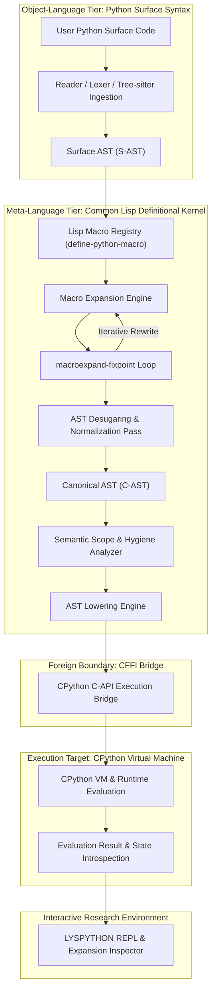

# LYSPYTHON

### LYSPYTHON: A Lisp-Macro-Defined Python Runtime & REPL
**"Redefining Python by defining it through Lisp."**

[](LICENSE)
[](RESEARCH.md)
[](https://common-lisp.net/)
[](https://www.python.org/)
[](ARCHITECTURE.md)
[](https://github.com/samudragupto/lys-python-runtime)

---

## 1. Abstract

LYSPYTHON is an extensible, macro-driven Python runtime architecture wherein Common Lisp macros define, transform, govern, and execute Python code in real time. Rather than treating Common Lisp as an interop client invoking foreign Python procedures or compiling Lisp syntax to Python bytecode, LYSPYTHON inverts the meta-hierarchy: Common Lisp acts as the active Language Definition Kernel (Meta-Language), while Python serves as the executable Surface Language (Object-Language). User-written Python constructs pass through a deterministic, fixed-point Common Lisp macro expansion layer, desugar into a canonical abstract syntax tree (AST), and evaluate directly on a native CPython virtual machine via foreign function interface (FFI) bindings. This architecture permits runtime redefinition of core imperative syntax, block scoping, and control structures while preserving full binary compatibility with third-party CPython extension libraries.

---

## 2. Why LYSPYTHON?

Conventional dynamic languages are semantically rigid. In CPython, constructs like `def`, `if`, `for`, `class`, and `try` possess immutable semantics baked into the C-implemented parser, AST generator, and bytecode compiler. Developers seeking to alter or experiment with Python syntax must resort to source preprocessors, AST rewriting hooks, bytecode hacking, or custom CPython forks.

Conversely, Common Lisp demonstrates that homoiconicity and syntactic macros grant programmers the ability to mold language semantics to their problem domains. LYSPYTHON bridges this historical divide: it imports the extensible semantic power of Common Lisp macros directly into Python's compilation and evaluation pipeline. Through LYSPYTHON, Python ceases to be a static language; it becomes an open, extensible dialect governed by Lisp.

---

## 3. The Core Idea: Semantic Inversion

Traditional cross-language architectures maintain a rigid relationship:
- **Lisp calls Python**: Common Lisp programs invoke Python libraries via remote procedure calls (RPC) or CFFI (e.g., Py4CL).
- **Lisp embeds in Python**: S-expression dialects transpile to Python ASTs or bytecode (e.g., Hy, Hissp).

LYSPYTHON executes a **Semantic Inversion**:

> **Lisp does not control Python. Lisp defines what Python means.**

In LYSPYTHON, surface Python code is not evaluated directly by CPython. Instead, every construct is parsed into an abstract syntax tree within Common Lisp, where a hierarchy of user and system macros rewrite, instrument, enforce, or replace the construct before it is lowered into CPython executable forms.

---

## 4. Vision Statement

The long-term objective of LYSPYTHON is to resolve an open question in programming language design:

> **What if Python was a fully extensible language whose syntax, semantics, control flow, and execution model could be redefined live at runtime using Lisp macros?**

LYSPYTHON serves as the reference implementation and laboratory for this paradigm, establishing a research-grade environment for language designers, compiler engineers, and systems researchers.

---

## 5. Research Motivation

The motivation behind LYSPYTHON spans three core axes:

1. **Language Malleability**: Enabling live experimentation with syntax and semantic variations (e.g., contracts, reversible computing, custom concurrency models) without modifying the CPython C-codebase.
2. **Pedagogy and Compiler Architecture**: Providing an inspectable, layered workbench that illustrates how surface syntax lowers to canonical forms through stepwise macro expansion.
3. **Ecosystem Preservation**: Demonstrating that an imperative language can achieve syntactic and semantic malleability without discarding its existing package ecosystem (e.g., NumPy, PyTorch, SciPy).

---

## 6. How Is This Different From Existing Approaches?

The following table contrasts LYSPYTHON with existing multi-language systems:

| Dimension | Py4CL | cl-python | Hy / Hissp | Racket (#lang) | LYSPYTHON |
| :--- | :--- | :--- | :--- | :--- | :--- |
| **Meta-Language** | None (RPC/FFI) | Common Lisp | Python | Racket | **Common Lisp** |
| **Object-Language** | Python | Python | Hy (Lisp-syntax) | Custom Domain | **Python** |
| **Execution Engine**| CPython VM | CL Runtime | CPython VM | Racket VM | **CPython VM** |
| **Macro Role** | None | Limited internal | Surface syntax | Module definitions | **Defines Python Semantics** |
| **Live Redefinition**| No | Partial | No | Yes (in Racket) | **Yes (Live in REPL)** |
| **NumPy/SciPy Support**| Yes | Poor | Yes | No | **Full (Native C-API)** |
| **Directionality** | Lisp calls Py | CL replaces Py | Py executes Lisp| Racket creates Lang| **Lisp defines Py** |

---

## 7. System Architecture Overview

LYSPYTHON is engineered as a clean multi-tiered architecture with rigorous layer boundaries:

1. **Kernel and Configuration Subsystem (`src/core/`, `src/config/`)**: Orchestrates global runtime state, error handling hierarchies, and execution modes.
2. **Reader and Surface Parser Subsystem (`src/reader/`, `src/ast/surface.lisp`)**: Translates Python concrete source or surface S-expressions into structured Surface AST instances.
3. **Macro Registry and Engine (`src/macros/`)**: Houses macro definitions registered via `define-python-macro`, executing deterministic fixed-point AST transformations.
4. **Canonical Desugaring and Semantics (`src/transform/`, `src/semantics/`, `src/ast/canonical.lisp`)**: Desugars complex forms into a minimal orthogonal core and performs scope and binding analysis.
5. **Lowering and CPython Bridge (`src/lowering/`, `src/bridge/`)**: Lowers canonical ASTs into CPython-executable forms and interfaces with `libpython` via CFFI.
6. **REPL and Inspector (`src/repl/`)**: Interactive shell providing live macro registration, expansion tracing, and namespace introspection.

---

## 8. Execution Pipeline

Every line of code executed in LYSPYTHON traverses the following formal pipeline:



---

## 9. Lisp-Macro-Defined Semantics

In LYSPYTHON, core Python constructs are not hard-coded compiler primitives. Instead, they are defined as Common Lisp macros.

Consider the baseline Python `if` statement. In LYSPYTHON, its behavior is governed by a macro:

```lisp
(define-python-macro if (condition then-branch else-branch)
  "Canonical definition of the Python conditional construct."
  (make-ast-canonical-if
   :condition condition
   :then-body then-branch
   :else-body else-branch))
```

If a researcher wishes to redefine `if` so that every branch evaluation logs execution telemetry or enforces deterministic transactional rollback, the researcher simply redefines the macro:

```lisp
(define-python-macro if (condition then-branch else-branch)
  "Redefined conditional with branch telemetry."
  `(ast-block
     (ast-call "telemetry.log_branch_eval" ,condition)
     (ast-canonical-if ,condition ,then-branch ,else-branch)))
```

When Python code containing `if` is subsequently executed, its semantics reflect the new Common Lisp definition immediately.

---

## 10. Key Features

- **Dynamic Macro Redefinition**: Alter the meaning of Python keywords live without restarting the runtime.
- **Fixed-Point Macro Expander**: Recursively expands AST forms until no further transformations apply, with cycle detection.
- **Step-by-Step Expansion Tracer**: Inspect every intermediate AST generated between surface syntax and canonical form.
- **Surface vs. Canonical AST Distinction**: Clean separation between human-authored syntax and minimal executable IR.
- **Native CPython C-API Integration**: Direct CFFI binding to `libpython` with deterministic foreign pointer reference counting.
- **Comprehensive Interactive REPL**: Built-in AST inspector, macro manager, namespace viewer, and execution modes.
- **Tree-sitter and LSP Foundations**: Architected for modern editor tooling, semantic highlighting, and inline macro expansion.

---

## 11. LYSPYTHON REPL

The LYSPYTHON REPL is an interactive language workbench designed for systems research.

Supported commands:
- `:help` - Display command reference and operational instructions.
- `:mode <name>` - Switch runtime modes (`:normal`, `:macro-trace`, `:ast-trace`, `:verbose`, `:research`).
- `:expand <expr>` - Interactively expand a Python form through registered macros without evaluating it.
- `:ast <expr>` - Display the Surface AST and Canonical AST representations of an expression.
- `:macros` - Enumerate all registered macros, priorities, and version numbers.
- `:trace on|off` - Enable or disable runtime step-by-step expansion tracing.
- `:env` - Inspect active lexical and global namespace bindings.
- `:bridge` - Display CPython C-API connection health and foreign object references.
- `:quit` - Terminate the REPL session cleanly.

---

## 12. Macro Expansion Inspector

The Expansion Inspector allows developers to answer: *"What did Lisp do to this Python code?"*

When `:mode :macro-trace` is engaged, executing a simple Python loop displays:
1. **Source Form**: Concrete Python syntax.
2. **Surface AST**: Direct parser output.
3. **Expansion Step 1..N**: Sequential macro transformations showing desugaring of `for` into iterator assignment and `while` loop.
4. **Canonical AST**: Normalized representation passed to the lowerer.
5. **Lowered Form**: Executable foreign representation passed to CPython.

---

## 13. Technology Stack

- **Host Language**: Common Lisp (Steel Bank Common Lisp - SBCL 2.2+ recommended).
- **Target Runtime**: CPython 3.10+ (`libpython3` shared library).
- **Foreign Function Interface**: CFFI (Common Foreign Function Interface).
- **Build and System Definition**: ASDF 3.3+.
- **Surface Parsing**: S-expression surface reader with Tree-sitter C-API integration.
- **Quality & CI**: GitHub Actions, POSIX Makefile, Python unittest, ASDF test-system.

---

## 14. Repository Structure

```text
lys-python-runtime/
|-- .editorconfig
|-- .gitignore
|-- ARCHITECTURE.md
|-- CHANGELOG.md
|-- CITATION.cff
|-- CODEOWNERS
|-- CODE_OF_CONDUCT.md
|-- CONTRIBUTING.md
|-- GOVERNANCE.md
|-- LICENSE
|-- Makefile
|-- README.md
|-- RESEARCH.md
|-- ROADMAP.md
|-- SECURITY.md
|-- SUPPORT.md
|-- lyspython.asd
|-- .github/
|   |-- CODEOWNERS
|   |-- FUNDING.yml
|   |-- PULL_REQUEST_TEMPLATE.md
|   |-- ISSUE_TEMPLATE/
|   |   |-- bug_report.yml
|   |   |-- config.yml
|   |   |-- feature_request.yml
|   |   `-- research_proposal.yml
|   `-- workflows/
|       |-- architecture-check.yml
|       |-- ci-lisp.yml
|       |-- docs-check.yml
|       |-- release.yml
|       `-- security-check.yml
|-- docs/
|   |-- design/
|   |   |-- ARCHITECTURE-SPEC.md
|   |   |-- IMPLEMENTATION-NOTES.md
|   |   `-- MACRO-SYSTEM.md
|   |-- diagrams/
|   |   |-- architecture.mermaid
|   |   `-- pipeline.mermaid
|   |-- notes/
|   |   |-- LSP-FOUNDATIONS.md
|   |   `-- TREE-SITTER-INTEGRATION.md
|   `-- theory/
|       |-- METAMACRO-FOUNDATIONS.md
|       `-- SEMANTIC-INVERSION.md
|-- src/
|   |-- core/
|   |   |-- kernel.lisp
|   |   `-- packages.lisp
|   |-- config/
|   |   `-- config.lisp
|   |-- utils/
|   |   |-- errors.lisp
|   |   `-- logging.lisp
|   |-- ast/
|   |   |-- canonical.lisp
|   |   `-- surface.lisp
|   |-- reader/
|   |   |-- parser.lisp
|   |   `-- tokens.lisp
|   |-- macros/
|   |   |-- builtin.lisp
|   |   |-- engine.lisp
|   |   `-- registry.lisp
|   |-- transform/
|   |   `-- desugar.lisp
|   |-- semantics/
|   |   `-- analyzer.lisp
|   |-- lowering/
|   |   `-- lower.lisp
|   |-- bridge/
|   |   |-- cpython.lisp
|   |   `-- python_bridge.py
|   |-- env/
|   |   `-- namespaces.lisp
|   |-- runtime/
|   |   `-- eval.lisp
|   |-- repl/
|   |   |-- core.lisp
|   |   |-- history.lisp
|   |   `-- inspector.lisp
|   |-- cli/
|   |   `-- main.lisp
|   |-- lsp/
|   |   `-- foundation.lisp
|   `-- extensions/
|       `-- sandbox.lisp
|-- examples/
|   |-- README.md
|   |-- basic/
|   |   |-- 01_hello_world.lys
|   |   `-- 02_control_flow.lys
|   |-- macro-experiments/
|   |   |-- 01_redefined_if.lisp
|   |   `-- 02_pattern_match.lys
|   `-- semantic-redesigns/
|       |-- 01_instrumented_def.lisp
|       |-- 02_contract_checking.lisp
|       `-- 03_pure_functional_python.lisp
|-- tests/
|   |-- packages.lisp
|   |-- run_tests.lisp
|   |-- unit/
|   |   |-- test_ast.lisp
|   |   |-- test_desugar.lisp
|   |   `-- test_macro_engine.lisp
|   |-- integration/
|   |   `-- test_pipeline.lisp
|   `-- research/
|       `-- test_semantic_inversion.lisp
|-- scripts/
|   |-- build_binary.sh
|   |-- run_repl.sh
|   `-- run_tests.sh
`-- tools/
    `-- ast_visualizer.py
```

---

## 15. Design Principles

- **Meta over Interop**: Prioritize language definition over superficial function-calling glue.
- **Semantics over Syntax**: Center engineering on the meaning of constructs rather than mere token arrangements.
- **Macros as Language Architects**: Use Lisp macros as formal AST re-writers, not simple text replacers.
- **Transformation First**: Ensure all language constructs pass through a clean, verifiable AST pipeline.
- **Live Extensibility**: Support live runtime re-binding of language semantics without process restart.
- **Deterministic and Traceable**: Provide deterministic expansions and comprehensive inspection traces.
- **Minimal Core, Maximum Extensibility**: Keep the evaluation kernel minimal and push semantics to macros.
- **Zero Emojis**: Maintain professional, academic, and publication-ready documentation standards.

---

## 16. Use Cases

1. **Programming Language Research**: Prototyping novel syntax, experimental type systems, or control flow mechanisms directly on top of Python.
2. **Domain-Specific Language (DSL) Engineering**: Creating specialized dialects for scientific computing, finance, or machine learning that preserve Python syntax while enforcing domain constraints.
3. **Compiler and Runtime Pedagogy**: Teaching macro systems, AST transformations, and compilation pipelines using Python as the object language and Lisp as the meta-workbench.
4. **Contract and Invariant Verification**: Injecting contract checks, pre/post-conditions, and runtime assertions into functions transparently at the macro layer.
5. **Dynamic Instrumentation and Telemetry**: Inserting non-intrusive tracing, profiling, and coverage instrumentation without altering application source code.

---

## 17. Getting Started

### Prerequisites
- Steel Bank Common Lisp (SBCL) 2.2 or later
- Quicklisp package manager installed in Common Lisp
- CPython 3.10+ with development headers and shared libraries (`python3-dev`)
- GNU Make and Git

### Loading in Common Lisp
```lisp
;; Register the system with ASDF
(asdf:load-asd (merge-pathnames "lyspython.asd" (truename ".")))

;; Load the system via Quicklisp
(ql:quickload :lys-python)

;; Initialize the runtime kernel and bridge
(lys.core:initialize-kernel)

;; Launch the interactive LYSPYTHON REPL
(lys.repl:start-repl)
```

---

## 18. Project Philosophy

LYSPYTHON is founded on the belief that a programming language's grammar and semantics should not be closed monoliths. By pairing the world's most expressive macro system (Common Lisp) with the world's most widely adopted data and scientific computing ecosystem (Python), we demonstrate that languages can be continuously adaptable without fragmenting their software ecosystems.

---

## 19. Research Potential

The research potential of LYSPYTHON includes:
- Empirical verification of multi-language macro hygiene.
- Quantitative benchmarking of fixed-point AST expansions.
- Formal translation of canonical ASTs to interactive proof assistants (e.g., Coq, Lean, ACL2).
- Automatic synthesis of domain-specific optimizations prior to VM execution.

See [RESEARCH.md](RESEARCH.md) for detailed academic framing and literature connections.

---

## 20. Roadmap

The project is structured across 13 progressive phases from foundational architecture to academic validation. Review [ROADMAP.md](ROADMAP.md) for milestone targets, task breakdowns, and current progress status.

---

## 21. Documentation

- [ARCHITECTURE.md](ARCHITECTURE.md) - Deep architectural specification, data flow, and lowering models.
- [RESEARCH.md](RESEARCH.md) - Theoretical foundations, formal problem statement, and comparative study.
- [ROADMAP.md](ROADMAP.md) - 13-phase development roadmap.
- [docs/design/](docs/design/) - Detailed subsystem specifications and design notes.
- [docs/theory/](docs/theory/) - Theoretical treatises on meta-macro systems and semantic inversion.

---

## 22. Contributing

We welcome contributions from compiler engineers, language researchers, and systems programmers. Please consult [CONTRIBUTING.md](CONTRIBUTING.md) for contribution guidelines, coding standards, and branch hygiene.

---

## 23. Code of Conduct

Participation in the LYSPYTHON project is governed by the Contributor Covenant Code of Conduct. Please review [CODE_OF_CONDUCT.md](CODE_OF_CONDUCT.md) for our community standards.

---

## 24. Security

For security vulnerability disclosure and our foreign memory management safety protocols, refer to [SECURITY.md](SECURITY.md).

---

## 25. Citation

If you use or reference LYSPYTHON in academic research, please cite our software artifact:

```bibtex
@software{lyspython2026,
  title = {{LYSPYTHON: A Lisp-Macro-Defined Python Runtime \& REPL}},
  author = {{LYSPYTHON Contributors}},
  year = {2026},
  url = {https://github.com/samudragupto/lys-python-runtime},
  version = {0.1.0-alpha}
}
```
See [CITATION.cff](CITATION.cff) for standard machine-readable metadata.

---

## 26. License

LYSPYTHON is licensed under the Apache License, Version 2.0. See [LICENSE](LICENSE) for terms and conditions.

---

## 27. Acknowledgements

We acknowledge the pioneering contributions of the Common Lisp community, the authors of SBCL, CFFI, and ASDF, and the Python Software Foundation for maintaining the CPython C-API.

---

## 28. Final Note

Language design is fundamentally an investigation into how humans structure computational intent. By unbinding Python from a fixed execution semantic and placing its definition into Common Lisp macros, LYSPYTHON offers a glimpse into a future where programming languages are living, programmable organisms rather than static tools.
