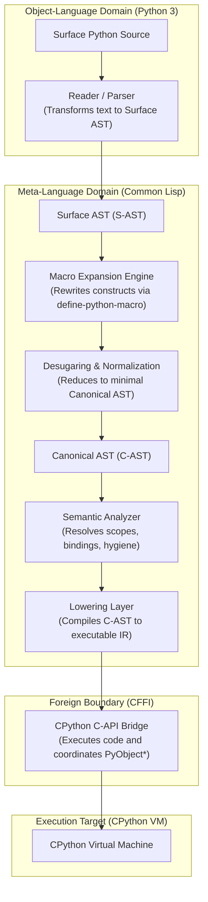

# Architectural Specification: Subsystem Decomposition and Contracts

## 1. Scope and Boundary Definition

LYSPYTHON decouples syntax ingestion and semantic governance from target execution. The host environment is Common Lisp (running SBCL), while the target execution engine is CPython 3.10+. The systems are bridged via the CFFI layer interfacing with `libpython`.

## 2. Invariant Contracts Across Interfaces

### Contract 1: Reader -> Surface AST
- **Precondition**: UTF-8 encoded string or s-expression stream.
- **Postcondition**: An instance of `ast-surface-node` hierarchy.
- **Invariants**: Every node retains source coordinates (line, column). No semantic resolution or variable binding occurs at this phase.

### Contract 2: Surface AST -> Macro Engine
- **Precondition**: Valid Surface AST.
- **Postcondition**: Irreducible AST where all operators registered in the active Macro Registry have been expanded.
- **Invariants**: Fixed-point expansion must terminate within `*max-macro-expansion-depth*`. Every step is recorded in `*expansion-trace*`.

### Contract 3: Macro Output -> Desugaring -> Canonical AST
- **Precondition**: Fully expanded AST.
- **Postcondition**: An instance of `ast-canonical-node` hierarchy.
- **Invariants**: Non-orthogonal constructs (`for`, `with`, complex assignments) are desugared into minimal primitives (`while`, `try-finally`, atomic stores).

### Contract 4: Canonical AST -> Lowering -> CPython Bridge
- **Precondition**: Semantically validated Canonical AST.
- **Postcondition**: Valid `PyObject*` handle or structured evaluation result.
- **Invariants**: Foreign reference counts (`ob_refcnt`) are strictly balanced. Any Python exception (`PyErr_Occurred`) is captured and converted to a Common Lisp `python-error` condition.
