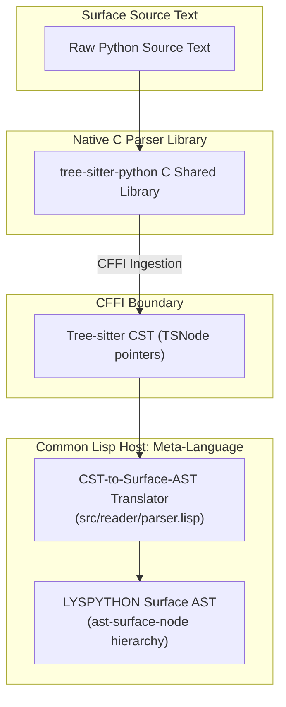

# Tree-sitter Integration Architecture

## 1. Role of Tree-sitter in LYSPYTHON

Tree-sitter provides concrete syntax tree (CST) parsing with incremental re-parsing, resilient error recovery, and zero-dependency C libraries.

In LYSPYTHON, Tree-sitter serves as the front-end parser converting raw Python source text into structured Concrete Syntax Trees, which are subsequently translated into LYSPYTHON Surface AST nodes.

## 2. Ingestion Pipeline

## 3. Fallback Reader

For environments where native Tree-sitter shared libraries (`libtree-sitter.so` / `tree-sitter.dll`) are unavailable or building from source is restricted, LYSPYTHON provides an S-Expression Surface Reader (`src/reader/tokens.lisp`, `src/reader/parser.lisp`). This reader consumes homoiconic surface forms directly into the same `ast-surface-node` structures.
