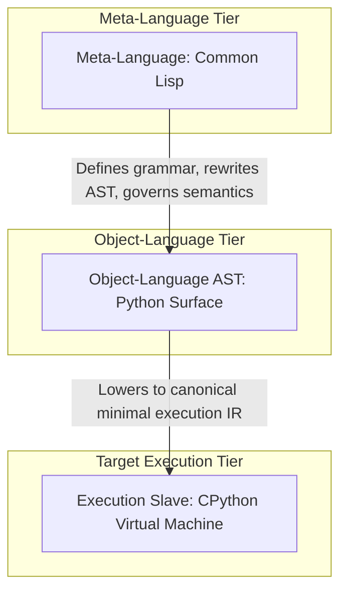

# Semantic Inversion: Inverting the Meta-Language Hierarchy

## 1. The Conventional FFI Paradigm

Traditional language interoperability relies on the client-server foreign function model:

In this model, the target runtime's semantics are completely opaque and immutable. When a Common Lisp process invokes a Python library via CFFI, Python's grammar, execution rules, and bytecode interpretation remain entirely untouched.

## 2. The Inversion Model

LYSPYTHON introduces **Semantic Inversion**:

In this model:
1. Python source is not treated as immutable bytecode input.
2. Common Lisp intercepts every syntactic construct prior to execution.
3. The meaning of `def`, `class`, `for`, and `if` is computed dynamically.
4. Python functions not as an autonomous interpreter, but as an execution backend that evaluates what Lisp has compiled.
